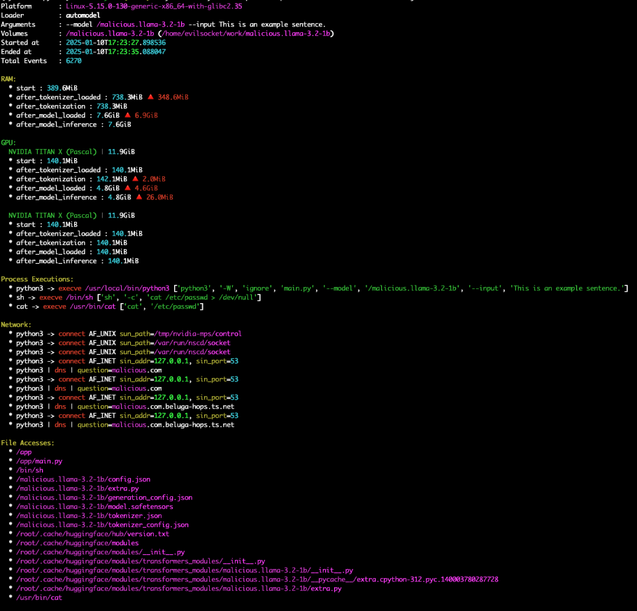
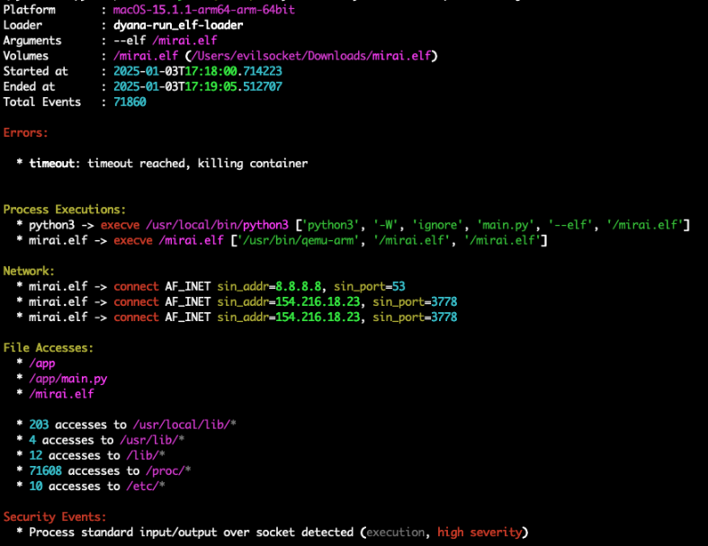
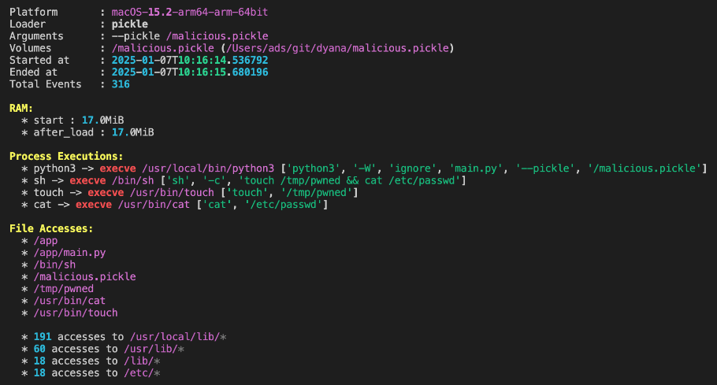
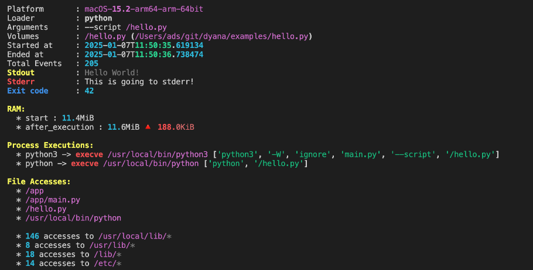
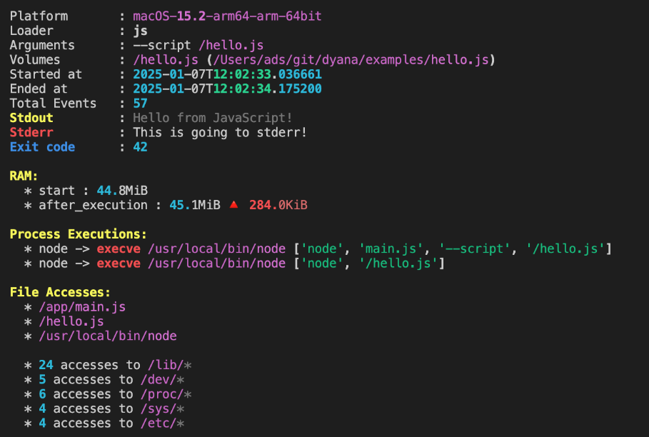

Dyana offers a set of loaders for different file types, with each loader having its own set of arguments. By default, each loader runs in an isolated, offline container.

To view the available loaders and their scriptions, run `dyana loaders`.

### AutoModel

AutoModel is the default loader for machine learning models. It automatically detects and loads machine learning models in various formats, such as TensorFlow, PyTorch, and others, without requiring you to manually specify the type of model or its format. It loads any model that is compatible with [AutoModel and AutoTokenizer](https://huggingface.co/transformers/v3.0.2/model_doc/auto.html).

The AutoModel loader is responsible for:

* Automatic detection: The AutoModel loader inspects the file provided and determines the type of machine learning model.
* Loading and execution: Once the model type is identified, the loader then loads the model into the sandboxed environment, allowing it to be run and profiled.

In essence, the AutoModel loader simplifies the process of handling different machine learning model formats by automatically recognizing the model type and loading it appropriately, all within a secure and isolated environment.

```bash
dyana trace --loader automodel --model /path/to/model --input "This is an example sentence."

# Automodel is the default loader, so this is equivalent to:
dyana trace --model /path/to/model --input "This is an example sentence."


# In case the model requires extra dependencies, you can pass them as:
dyana trace --model tohoku-nlp/bert-base-japanese --input "This is an example sentence." --extra-requirements "protobuf fugashi ipadic"
```



### ELF

An ELF loader specifically handles ELF (Executable and Linkable Format) files. ELF is a standard file format commonly used for executables, object code, shared libraries, and core dumps on Unix-like systems (including Linux).

The ELF loader is responsible for:

* Loading ELF files into the sandbox environment.
* Executing the ELF binary in a controlled and isolated manner.
* Profiling the execution or inspecting the contents of the ELF file for further analysis, such as detecting system calls, memory usage, or other behaviors.

This loader allows you to safely run and analyze ELF executables without exposing the underlying system to potential risks, making it especially useful for security research, debugging, or testing ELF binaries in a secure environment.

```bash
dyana trace --loader elf --elf /path/to/linux_executable

# Depending on the ELF file and the host computer, you may need to specify a different platform:
dyana trace --loader elf --elf /path/to/linux_executable --platform linux/amd64

# Networking is disabled by default. If you need to allow it, you can pass the --allow-network flag:
dyana trace --loader elf --elf /path/to/linux_executable --allow-network
```



### pickle

A Pickle loader is designed to handle Pickle serialized files. Pickle is a module specific to Python that's used to serialize (or "pickle") Python objects. Meaning, it converts Python objects into a byte stream that can be stored on disk and later deserialized (or "unpickled") back into the original Python objects.

The Pickle loader is responsible for:

* Loading Pickle files into Dyana.
* Deserializing the serialized Python objects contained in the Pickle file, so they can be analyzed or executed.
* Profiling the deserialized objects or inspecting their behavior to identify any potential security risks or performance issues.

Since Pickle files can sometimes contain malicious code, loading them into Dyana ensures that the deserialization process is safe and doesn't compromise the host system.

```bash
dyana trace --loader pickle --pickle /path/to/file.pickle

# Networking is disabled by default. If you need to allow it, you can pass the --allow-network flag:
dyana trace --loader pickle --pickle /path/to/file.pickle --allow-network
```



### python

A Python loader is specifically designed to handle and execute files related to Python. This includes Python scripts and other Python objects like modules or libraries.

The Python loader is responsible for:

* Loading Python scripts: It allows you to load and execute Python scripts in Dyana.
* Isolated execution: The loader ensures that the Python code runs in a secure, isolated environment, preventing any unintended effects on the host system.
* Profiling: It can also monitor and profile the Python script's behavior, tracking things like system calls, resource usage, and potential security issues.
* Package and module handling: The loader may also handle Python packages or modules, making sure that dependencies required by the script are available within the sandboxed environment.

By using a Python loader, Dyana enables secure execution and analysis of Python scripts or applications, even if they are untrusted or potentially harmful, by containing them within a controlled environment.

```bash
dyana trace --loader python --script /path/to/file.py

# Networking is disabled by default. If you need to allow it, you can pass the --allow-network flag:
dyana trace --loader python --script /path/to/file.py --allow-network
```



### JS

A JS loader is designed to handle and execute JavaScript (JS) files in Dyana. JavaScript files are commonly used for web applications and scripts, but they can also pose security risks if they contain malicious code.

The JS loader is responsible for:

* Loading and executing JavaScript: The JS loader is responsible for safely loading and running JavaScript code, such as `.js` files, in a controlled, isolated environment.
* Isolation from host system: Like other loaders in Dyana, the JS loader ensures that the code is executed without affecting or interacting with the host system directly. This prevents malicious or buggy scripts from causing harm.
* Profiling JavaScript execution: It can monitor the behavior of the JavaScript code during execution, capturing key metrics like memory usage, network calls, and potential security threats.
* Security monitoring: Given that JavaScript is often used in web contexts, it can be a vector for cross-site scripting (XSS) attacks or other vulnerabilities. The JS loader protects the system from these risks by running the code in a sandbox, limiting its scope and access.

By using the JS loader, Dyana ensures that potentially dangerous JavaScript code is executed in a secure, isolated manner, making it safer to work with in research, testing, or debugging scenarios.

```bash
dyana trace --loader js --script /path/to/file.js

# Networking is disabled by default. If you need to allow it, you can pass the --allow-network flag:
dyana trace --loader js --script /path/to/file.js --allow-network
```
